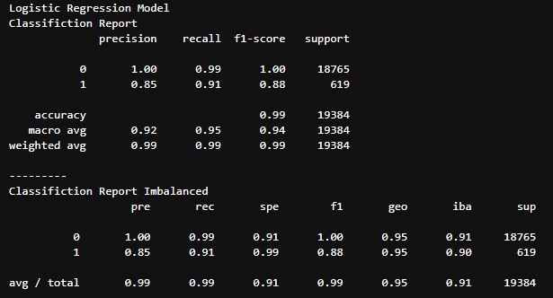
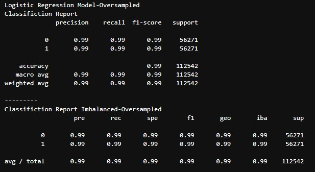

# Module-12

## Overview of the Analysis

### The purpose of the analysis provided was to build a model that can identify the creditworthiness of borrowers, using imballanced classes since healthy loans easily outnumber risky loans.

### The data provided was historical lending activity from a peer-to-peer lending services company, which was used as the original data.  
* Provide basic information about the variables you were trying to predict (e.g., ).
### We were trying to predict if the status of the loan is considered low-risk(0) or high-risk(1) this would be done using `value_counts` to make check on the number of low and high risk selections already set in the dataframe.

### First the data was imported  labeled and classified then split into the training sets and test sets using the `train_test_split` from `sklearn`.
### The first test was run using `LogisticRegression` and the second test was run using `RandomOverSampler`

## Results

* Machine Learning Model 1 LogisticRegression:
  

* Machine Learning Model 2 RandomOverSampler:
  

## Summary

Summarize the results of the machine learning models, and include a recommendation on the model to use, if any. For example:
* Which one seems to perform best? How do you know it performs best?
* Does performance depend on the problem we are trying to solve? (For example, is it more important to predict the `1`'s, or predict the `0`'s? )

If you do not recommend any of the models, please justify your reasoning.